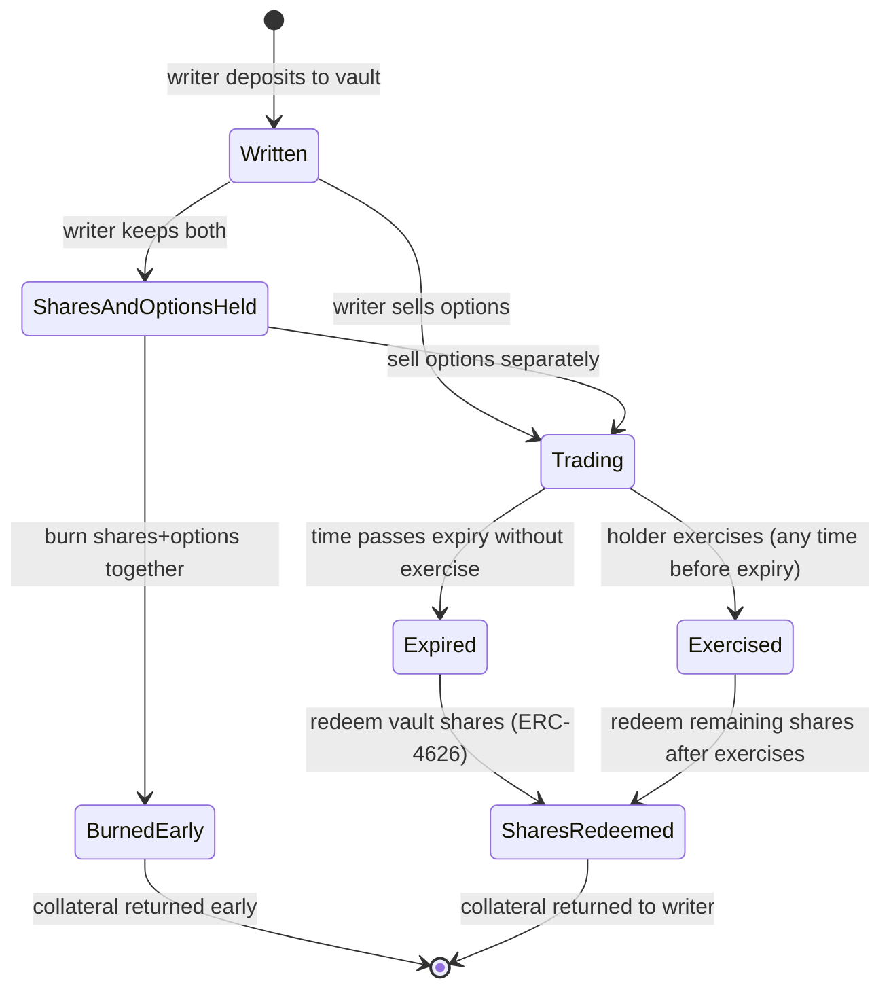
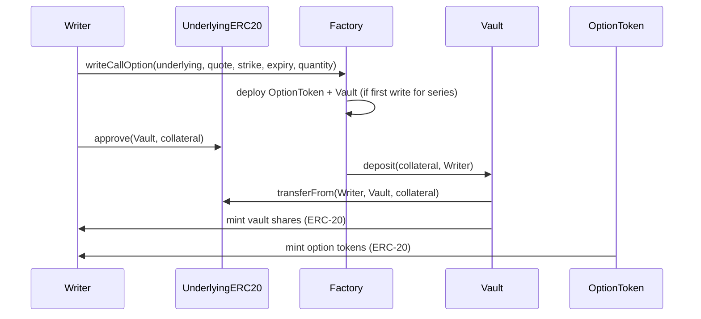
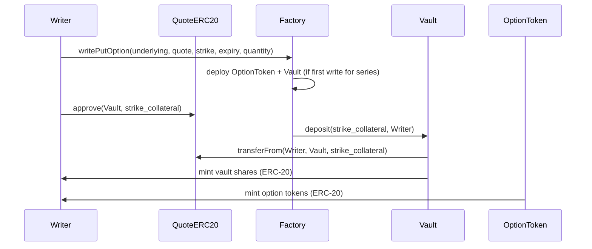
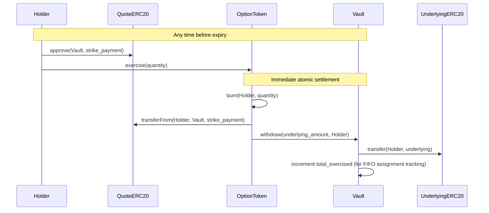
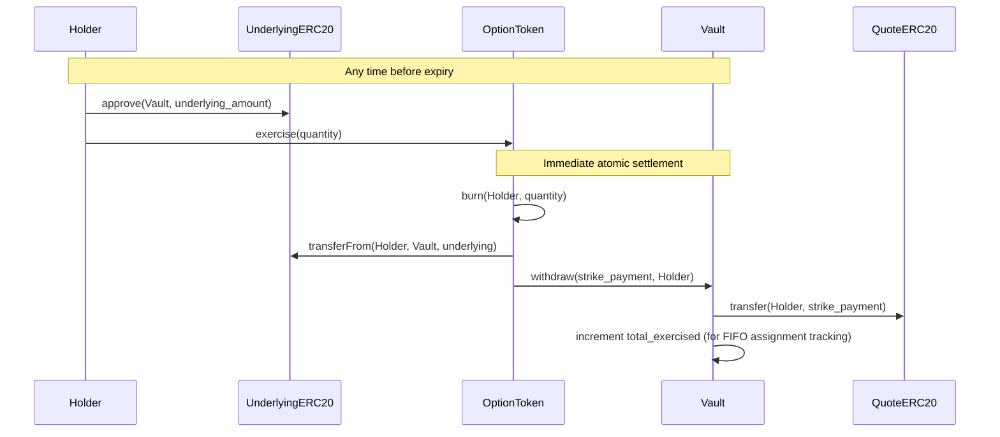
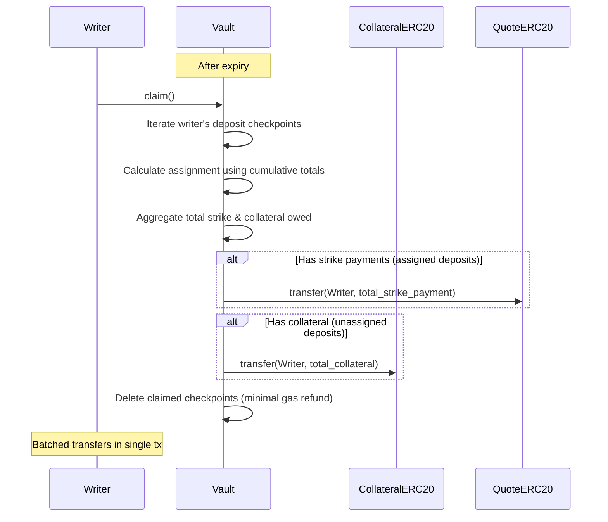
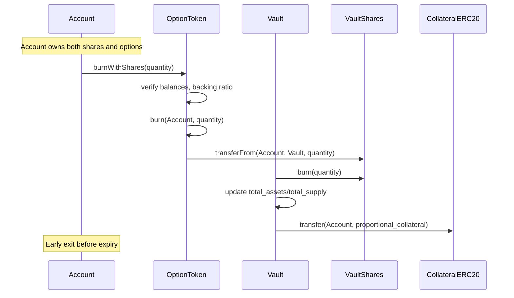

# SPEC.md

This specification outlines a fully on-chain options protocol. The design
prioritizes simplicity and reliability through physical settlement with 100%
collateralization, eliminating the need for oracles, risk management systems,
and liquidation mechanisms.

## Overview

### PoC Scope

- Users can write (sell) and buy options as ERC-20 tokens (one contract per
  series)
- Each option series has dedicated vault (ERC-4626) for collateral management
- Options trade on any standard DEX (Uniswap, etc.) or trading venue
- Settlement is physical (actual token delivery) with manual exercise
- All collateral is 100% locked in the underlying assets (no fractional reserve)
- ERC20 token pairs
- American options (exercise any time before expiry)

### Key Architectural Decisions

- **ERC-20 per Option Series**: Each option series is a separate ERC-20 contract
  - Maximum DeFi composability (works with all AMMs, lending, wallets)
  - Proven model (Opyn, established options protocols)
  - Factory pattern for efficient deployment
  - Separate token from vault shares
    - Option token represents the right but not the obligation to exercise
      before maturity
    - Vault share token represents the right to the corresponding collateral if
      not assigned before maturity
    - Owning both allows users to burn the tokens and withdraw the collateral
      before maturity
- **Vault-Based Collateral**: ERC-4626 vaults manage collateral per option
  series
  - Writers deposit collateral, receive vault shares (ERC-20) + option tokens
    (ERC-20)
  - Both tokens independently transferrable
  - Exercise reduces vault assets, affecting all share holders proportionally
  - Enables standard DeFi composability for both tokens
- **Trustless by Design**: Physical settlement means no reliance on external
  price feeds
- **Simplicity First**: 100% collateralization eliminates complex risk
  management
- **FIFO Individual Assignment**: Writers assigned in deposit order (first
  deposits assigned first)
  - Cumulative checkpoints enable efficient binary search for cutoff
  - Strike payments distributed to assigned writers
  - Unassigned writers redeem collateral
  - No oracle needed for mixed-asset valuation
- **Future Compatible**: Architecture supports adding cash settlement and
  oracles later
- **Permissionless**: Any ERC20 token pair can have options created

### Definitions

**Call Option**: Right (not obligation) to BUY the underlying ERC20 token at
strike price

- Holder: Pays premium, can exercise to buy underlying at strike price
- Writer: Receives premium, must deliver underlying token if holder exercises
- Collateral: Writer locks 1:1 underlying ERC20, e.g. 1 WBTC for 1 WBTC call
  (covered call)

**Put Option**: Right (not obligation) to SELL the underlying ERC20 token at
strike price

- Holder: Pays premium, can exercise to sell underlying at strike price
- Writer: Receives premium, must accept underlying and pay strike if holder
  exercises
- Collateral: Writer locks strike amount in quote token, e.g. $123,000 USDC for
  1 WBTC put at $123k strike (cash secured put)

---

**American Option**: An option that can be exercised at any time before or at
expiry. This PoC implements American-style exercise, allowing holders to
exercise immediately whenever profitable. The 100% collateralization model means
writers are always fully protected regardless of when exercise occurs.

---

**Physical Settlement**: Actual token delivery on exercise

- Call exercise: Holder pays strike in quote token -> receives underlying token
- Put exercise: Holder delivers underlying token -> receives strike in quote
  token
- No oracle required (holder decides if exercise is profitable)

## User Flows

#### Flow 1: Writing (Selling) an Option

Actors: Option Writer

Steps:

1. Writer selects option parameters (underlying ERC20, quote ERC20, strike,
   expiry, type, quantity)
2. Contract calculates required collateral based on option type
3. Writer approves ERC20 token transfer to vault contract
4. Contract executes:
   - Deploys new ERC-20 option token contract (if first write for this series)
   - Deploys new ERC-4626 vault contract (if first write for this series)
   - Deposits collateral into vault
   - Mints vault shares (ERC-20) to writer proportional to deposit
   - Mints option tokens (ERC-20) to writer equal to quantity
5. Writer can now sell option tokens on any DEX or trading venue, or hold them
6. Writer retains vault shares representing claim on collateral

Collateral:

- Calls: Underlying ERC20 tokens (1:1 ratio) deposited to underlying vault
- Puts: Quote ERC20 tokens (strike \* quantity) deposited to quote vault

Outcome:

- Option tokens (ERC-20) minted to writer
- Vault shares (ERC-20) minted to writer (separate token contract)
- Collateral deposited into vault
- Writer can trade both tokens independently

#### Flow 2: Exercise

Actors: Option Holder

Steps:

1. Holder decides to exercise option tokens (any time before expiry)
2. Holder approves ERC20 token transfer to vault contract:
   - For calls: Quote tokens (strike payment)
   - For puts: Underlying tokens
3. Holder calls option token's `exercise(quantity)` function
4. Contract executes immediately:
   - Transfers holder's payment tokens to vault (strike for calls, underlying
     for puts)
   - Vault transfers corresponding assets to holder (underlying for calls,
     strike for puts)
   - Burns holder's ERC-20 option tokens
   - Vault total assets decrease, reducing value of all vault shares
     proportionally

**Constraints and Edge Cases:**

- **Partial exercise:** Holder can exercise any quantity <= their balance

  - Example: Own 10 options, exercise 7.5, keep 2.5 active

- **Timing:** Can exercise any time before expiry

  - Before expiry: Full exercise available
  - At/after expiry: Exercise disabled, options expire worthless

- **Requirements:**

  - Holder must have sufficient option token balance
  - Holder must have approved sufficient payment tokens to vault
  - Holder must have sufficient payment token balance
  - Transaction must occur before expiry timestamp
  - Vault must have sufficient collateral to settle exercise

- **No cancellation:** Exercise is immediate and irreversible

  - Tokens exchanged atomically in single transaction
  - No intermediate state

- **FIFO assignment:** Writers assigned in deposit order
  - Earlier deposits assigned first (FIFO queue)
  - Assigned writers receive strike payments
  - Unassigned writers redeem collateral
  - Holder doesn't specify which writer (assignment automatic)
  - Fair ordering based on deposit time

Outcome: Immediate settlement, tokens exchanged, option tokens burned, vault
assets reduced

#### Flow 3: Collateral/Strike Claim After Expiry

Actors: Option Writer

After expiry, writers claim either strike payments (if assigned) or collateral
(if not assigned) based on FIFO deposit order.

**Assignment Logic:**

- Writers assigned in deposit order (FIFO)
- First deposits up to `total_exercised` amount get assigned
- Assigned writers receive strike payments
- Unassigned writers receive collateral back

Steps:

1. Time passes beyond expiry timestamp
2. Writer calls `claim()` to retrieve their entitlement
3. Vault calculates assignment for each of writer's deposits:
   - Uses cumulative totals to determine if deposit was assigned
   - Aggregates total strike payments and collateral owed
4. Vault makes batched transfers:
   - Single transfer for total strike payments (if any assigned)
   - Single transfer for total collateral (if any unassigned)
5. Vault deletes claimed checkpoints (minimal gas refund)

**Constraints:**

- **Only after expiry:** Cannot claim until options expired
- **Single-step process:** Just call `claim()`, no setup needed
- **Per-deposit granularity:** Each deposit tracked individually with FIFO
  ordering
- **No time limit:** Writers can claim indefinitely after expiry
- **Gas scales with writer's deposit count:** More deposits = higher claim gas
  cost (typically 1-5 deposits per writer per series)

**Why FIFO assignment:**

- Fair: Earlier deposits take priority
- No oracle needed: Strike payments and collateral tracked separately
- Deterministic: Assignment based purely on deposit order and exercise count
- Simple: Single function call, no coordination needed

**Example:**

- Alice deposits 100 WBTC (index 0, cumulative: 100)
- Bob deposits 50 WBTC (index 1, cumulative: 150)
- Charlie deposits 75 WBTC (index 2, cumulative: 225)
- Total exercised: 120 WBTC

Assignment (calculated during claim):

- Alice (100): cumulative_before=0, fully assigned -> receives 100 * strike in
  USDC
- Bob (50): cumulative_before=100, fully assigned -> receives 50 * strike in
  USDC
- Charlie (75): cumulative_before=150, partially assigned (120-150=-30) ->
  receives (20 * strike) USDC + 55 WBTC

Outcome: Writer receives strike payments (if assigned) or collateral (if not
assigned) in single batched transfer

#### Flow 4: Early Collateral Redemption

Actors: Account holding both vault shares AND option tokens

Writers who retain both vault shares and option tokens can reclaim collateral
early by burning matching quantities of both, bypassing full exercise flow.

Steps:

1. Account verifies ownership of both:
   - Vault shares (ERC-20 from vault)
   - Option tokens (ERC-20 for same option series)
2. Account calls option token's `burnWithShares(quantity)` function
3. Contract verifies:
   - Account has sufficient vault shares
   - Account has sufficient option tokens
   - Quantity doesn't exceed available backing ratio
4. Contract executes atomically:
   - Burns option tokens from account
   - Burns vault shares from account
   - Transfers proportional collateral to account
   - Updates vault total assets and total supply

**Constraints:**

- **Matching quantities required:** Must burn equal amounts of shares and
  options
- **Backing ratio enforced:** Cannot burn more than vault can back
  - Example: Vault has 100 assets, 100 shares, 80 options outstanding
  - Can burn up to 80 shares+options (the limiting factor)
- **Any time before expiry:** Available throughout option lifecycle
- **Optimized path:** Cheaper than selling options then redeeming shares
  separately

**Why needed:**

- Writers who keep both shares and options can exit position early
- More gas-efficient than market selling + share redemption
- Useful when option is OTM and writer wants to close position
- Reduces total outstanding options, freeing vault capacity

**Example:**

Writer writes 10 calls, keeps 7 shares + 7 options, sells 3 options to market:

- Can burn 7 shares + 7 options to reclaim 70% of original collateral
- Remaining 3 shares stay in vault backing the 3 sold options
- After expiry (if not exercised), can redeem final 3 shares

Outcome: Both option tokens and vault shares burned, collateral returned early

### Option Lifecycle

### Contract execution flows

#### Write Call Option

#### Write Put Option

#### Call Exercise

#### Put Exercise

#### FIFO Assignment and Claim After Expiry

#### Early Redemption

## Architecture

All contracts implemented in Solidity, leveraging OpenZeppelin contracts for
standard token implementations and security patterns.

### Two-Token Architecture per Option Series

The system deploys **two separate ERC-20 tokens per option series**:

1. **Option Token (ERC-20)** - represents long position (right to exercise)
2. **Vault Share (ERC-4626/ERC-20)** - represents short position + collateral
   claim

Both tokens are independently transferrable, enabling separated long/short
option markets.

#### OptionFactory Contract

- **Factory pattern**: Deploys option token + vault pairs for new series
- **Deterministic addresses**: Option parameters hash to predictable contract
  addresses
- **Registry**: Tracks all deployed option series
- **Permissionless**: Anyone can deploy new option series

#### OptionToken Contract

- **Standard ERC-20**: Full compatibility with all DeFi protocols
- **Exercise functionality**: `exercise(quantity)` burns tokens, coordinates
  settlement
- **Burn with shares**: `burnWithShares(quantity)` early exit if holder owns
  both
- **Vault integration**: Calls vault for collateral transfers during exercise
- **Immutable metadata**: Strike, expiry, underlying, quote hardcoded at
  deployment

#### OptionVault Contract

- **One vault per option series** (1:1 with option token contract)
  - Example: WBTC/USDC 60k Call Dec-31 has:
    - OptionToken ERC-20 (tradeable call option)
    - OptionVault ERC-4626 (WBTC collateral pool)
  - Isolates collateral and risk per series
- **Collateral custody**: Holds ALL underlying/quote tokens for series
- **Share issuance**: Mints ERC-20 vault shares to writers proportional to
  deposits
- **Proportional settlement**: Exercises reduce vault assets, affecting all
  shareholders
- **Standard ERC-4626**: Full compliance for composability
- **Post-expiry redemption**: Writers redeem shares for remaining collateral
- **Backing enforcement**: Prevents share redemption if options outstanding

**Per-Series Isolation Rationale:**

- Risk isolation: Each series has separate collateral pool
- Simple accounting: No cross-series tracking needed
- Clear expiry: Vault lifecycle matches option lifecycle
- Predictable redemption: Share value only affected by same-series exercises

Trade-off: More contract deployments vs unified liquidity pool. Per-series
isolation prioritizes safety and simplicity.

#### Why This Design

**Two separate tokens per series:**

- **Option Token (ERC-20)** = Long exposure (right to exercise)
  - Holder can transfer/sell without affecting collateral
  - Burns on exercise
- **Vault Share (ERC-20)** = Short exposure + collateral claim
  - Writer exposed to assignment (share value decreases on exercise)
  - Redeemable for collateral after expiry
  - Transferrable (sell short position to exit)

**Writer flexibility:**

- Keep shares, sell options: remain exposed to FIFO assignment
- Sell both: full exit from position
- Keep both, burn together: reclaim collateral anytime
- FIFO assignment means earlier deposits have priority

**Universal composability:**

- Both tokens are standard ERC-20
- Trade on any DEX (Uniswap, Curve, Balancer)
- Use in lending (Aave, Compound)
- Aggregate in protocols (Yearn, Convex)

**FIFO assignment:**

- Writers assigned in deposit order (earlier = higher priority)
- Assignment calculated on-demand during claim using cumulative totals
- No oracle needed for mixed collateral/strike valuation
- Fair and deterministic
- Single function call, no coordination needed

### Implementation Details

**Deployment:**

- Factory uses OpenZeppelin Clones (EIP-1167) with CREATE2 for gas-efficient
  deterministic addresses
- Series ID: `keccak256(abi.encode(underlying, quote, strike, expiry, isCall))`

**Storage:**

- OptionFactory: `mapping(bytes32 => SeriesContracts)` for series registry
- OptionToken: Immutable parameters (underlying, quote, strike, expiry, isCall,
  vault)
- OptionVault: FIFO tracking via `DepositCheckpoint[]` array with cumulative
  totals

**Token Decimals:**

- All amounts normalized to 18 decimals for internal calculations
- Convert to native decimals only for ERC20 transfers
- Series ID generation uses normalized values for consistency

**Unsafe Tokens:**

- Fee-on-transfer: Check balance before/after, revert on mismatch
- Rebasing: No protection, document risk
- Blacklists: No protection, accept risk
- Overflow: Solidity 0.8+ automatic checks

**Testing:**

- Foundry for unit tests, fuzzing, and gas reports
- Fork testing against real tokens (USDC, WBTC)
- Property-based invariant testing

## Security Considerations

### Attack Vectors & Mitigations

**ERC-4626 Inflation Attack:**

- **Attack:** First depositor deposits 1 wei, then directly transfers large
  amount to vault to inflate share price
- **Impact:** Subsequent depositors receive 0 shares due to rounding, attacker
  claims their deposits
- **Attack Window:** Only affects first deposit into new vault (first writer for
  each option series)
- **Mitigation: Virtual Shares + Decimals Offset (OpenZeppelin)**
  - Hardcoded `decimals_offset=3` in vault constructor (built into OpenZeppelin
    ERC-4626)
  - NOT a parameter - prevents bypass attacks where attacker deploys vault with
    offset=0
  - Virtual shares/assets included automatically, make attack unprofitable even
    with offset=0
  - Offset=3 provides 1000x security multiplier (attacker must donate 1000x to
    steal 1x)
  - No oracle or pricing data required (pure mathematical protection)
  - Uniform security across all option series regardless of underlying value
  - Maintains full ERC-4626 standard compliance
- **Why offset=3 specifically:**
  - offset=0: Virtual shares alone make attack unprofitable (attacker loss >=
    user deposit)
  - offset=3: 1000x amplification, extremely strong protection
  - offset=6: 1M x amplification, overkill for most use cases with higher gas
    costs
  - Tradeoff: offset=3 provides excellent security without excessive gas
    overhead
- **Why hardcoded (not parameter):**
  - Eliminates risk of deploying vault with weak/no protection
  - No configuration needed (simpler, safer)
  - Prevents factory implementation bugs from bypassing protection
- **Why Not Minimum Deposit:** Options have wildly different collateral values
  (1 WBTC vs 100 USDC), no pricing oracle to set appropriate minimums
- **Why Not Dead Shares:** Adds operational complexity (factory must hold all
  collateral tokens), offset is simpler and equally effective
- **Why Not Dynamic Offset:** Cannot determine "high-value" vs "low-value"
  without pricing oracle, fixed offset=3 provides uniform strong protection

**Reentrancy:**

- Contracts follow checks-effects-interactions pattern
- Burn option tokens/shares BEFORE external transfers
- Use OpenZeppelin's ReentrancyGuard on sensitive functions
- ERC-4626 implementation uses SafeERC20 for token transfers
- Vault exercises must update state before external calls

**Collateral Theft:**

- No admin withdrawal functions
- Vault collateral only released through:
  1. Exercise settlement (holder receives underlying/strike)
  2. Share redemption (writer receives proportional assets)
  3. Burn shares + options (account receives collateral)
- Only OptionsToken contract can call vault's exercise functions

**Time Manipulation:**

- Expiry uses `block.timestamp`
- Miners have approx. 15 second influence on timestamp
- Not exploitable for 1+ hour expiries
- Vault redemption gates enforce expiry check

**Vault Share Redemption:**

- Share holders could attempt to redeem shares while options still outstanding
- **Impact:** Would under-collateralize vault if redemption removes collateral
  needed for exercises
- **Mitigation:** Track `options_outstanding` in vault, prevent share redemption
  that would leave insufficient collateral for outstanding options

### Known Limitations & Risks

**Collateral Lock Risk:**

- 100% collateralization means lower capital efficiency vs cash-settled options
- Writers' collateral locked in vaults until expiry or early redemption
- Writers can exit early via:
  1. Burn shares + options together (if still hold both)
  2. Sell vault shares on DEX (loses exposure to unexercised collateral)
  3. Buy back options on market, then burn with shares
- American exercise helps: holders exercise early when ITM, freeing vault
  capacity

**Vault Share Management:**

- Writers must manage TWO tokens: vault shares (ERC-20) and options (ERC-20)
- Selling shares without options: gives up claim on collateral, reduces exposure
- Selling options without shares: retains short exposure to assignment
- Requires understanding of vault mechanics and backing ratios

**Post-Expiry FIFO Assignment:**

- Single-step process: Writer calls `claim()` after expiry
- Assignment calculated on-demand using cumulative deposit totals
- Assigned writers receive strike payments, unassigned receive collateral
- Batched transfers (one for strike, one for collateral) regardless of deposit
  count
- Gas cost scales with writer's deposit count (typically 1-5 deposits per
  series)
- Collateral/strike remain safe indefinitely until claimed

**Per-Series Vault Model:**

- Each option series has separate vault (no cross-collateralization)
- Writers must deposit separately for each strike/expiry combination
- Less capital efficient than unified vault per underlying
- Trade-off: Simplicity and risk isolation vs capital efficiency
- Future versions could aggregate vaults for better capital utilization

**ERC-4626 Composability Risks:**

- Vault shares tradeable on any DEX (standard ERC-20)
- Share buyers without options have no benefit (pure liability)
- Share price drops as exercises occur (asymmetric exposure)
- Not suitable for standard DeFi yield strategies
- Documentation must clearly explain vault shares != typical yield-bearing
  tokens
